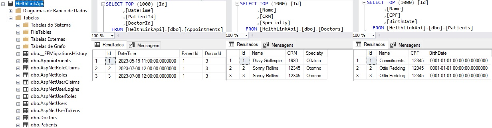

# Modelagem

- [Atores](#atores)

- [Entidades](#entidades)

- [Regras de interação](#regras-de-interação)

- [Endpoints](#endpoints)

- [Testes](#testes)

- [Regras de validação](#regras-de-validação)

- [Padrões](#padrões)

- [Tecnologias utilizadas](#tecnologias-utilizadas)

 

## Atores 
* Doctor
* Patient
 

## Entidades
* Doctor
   * Id (int)
   * Name (string)
   * CRM (string)

* Patient
   * Id (int)
   * Name (string)
   * CPF (string)
   * Data de Nascimento (DateTime)

* Appointment
   *  Id (int)
   *  Id Doctor (int)
   *  Id Patient (int)
   *  DateTime Appointment (DateTime)
 

## Regras de interação
* Um médico pode ter várias consultas com diferentes pacientes
* Um paciente pode ter várias consultas com diferentes médicos
 

## Endpoints
* Cadastro de médico: POST /medico
* Edição de médico: PUT /medico/{id}
* Leitura geral de médicos: GET /medicos
* Leitura específica de médico: GET /medico/{id}
* Remoção de médico: DEL /medico/{id}
* Cadastro de paciente: POST /paciente
* Edição de paciente: PUT /paciente/{id}
* Leitura geral de pacientes: GET /pacientes
* Leitura específica de paciente: GET /paciente/{id}
* Remoção de paciente: DEL /paciente/{id}
* Cadastro de consulta: POST /consulta
* Edição de consulta: PUT /consulta/{id}
* Leitura geral de consultas: GET /consultas
* Leitura específica de consulta: GET /consulta/{id}
* Remoção de consulta: DEL /consulta/{id}

## Testes
   Resultados da migration e dos testes feitos com os 3 bancos:
   * SQLite  
      
   * SQLServer  
      
   * MySql  
      

## Regras de validação
* Todos os campos obrigatórios devem ser fornecidos ao cadastrar um médico, paciente ou consulta
* A data e hora da consulta não pode ser anterior à data atual

## Padrões
* O padrão Repository deve ser utilizado para abstrair o acesso à base de dados e facilitar a troca de provedores de persistência
* O padrão IoC deve ser utilizado para facilitar a injeção de dependências, permitindo a substituição de implementações de forma fácil e modular
* O padrão ID deve ser utilizado para garantir a unicidade das entidades e facilitar a implementação do Repository.

## Tecnologias utilizadas

